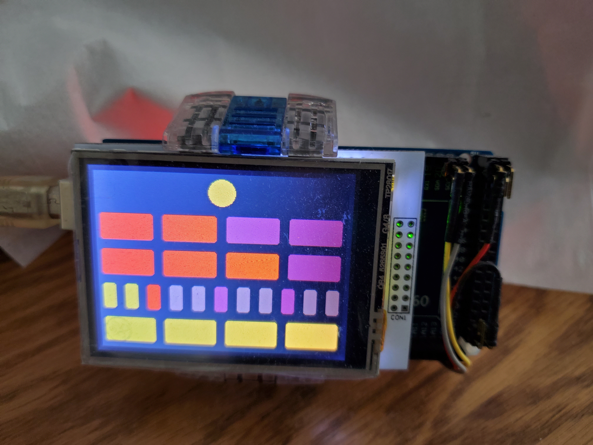

# blnuhr_touchscreen

The time is 13:19

[Arduino sketch for blnuhr clock](blnuhr/blnuhr.ino)

## How to change the time?

First, you need to make a *long touch* on the screen (long enough that
the blue rectangle in the upper right corner changes to green), then
release.  (A two-fingered touch will probably help.  Been having
problems with debounce here.)  The screen will change into controls to
increase/decrease the various time digits.  Touch *Ok* when finished.

It might take several tries to successfully complete a *long touch*.  A
*short touch* (blue rectangle in upper right corner) will show the
temperature.

The touch screen is fussy and will often toggle rapidly between pressed
and not pressed.  Averaging is used to smooth that out but the touch
recognition controls could use more work.
